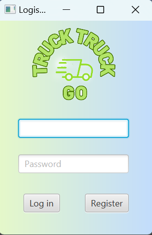
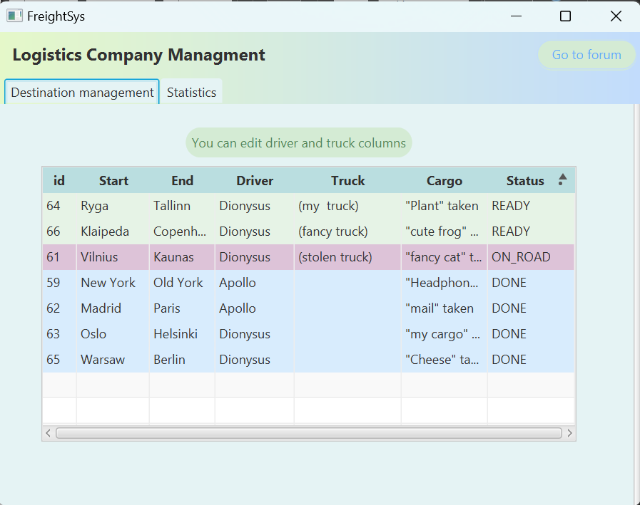
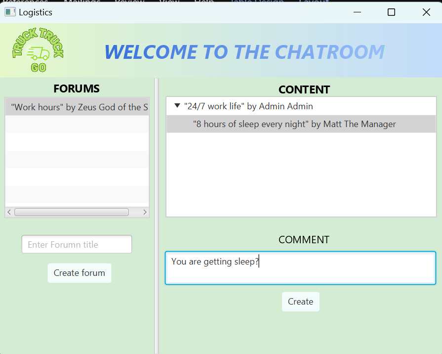

# Logistics Company "Truck Truck Go"

## About the project
This is a university semester project that uses:
1. Hibernate;
2. JDA;
3. Scenebuilder;
4. mySQL;
5. IntelliJ;
6. JavaFX;

*The main functions* are in the managment of
1. Users ( Drivers and Managers)
2. Destinations
3. Trucks
4. Cargos
5. Forums
6. Comments

# Visuals (more available in the folder)

